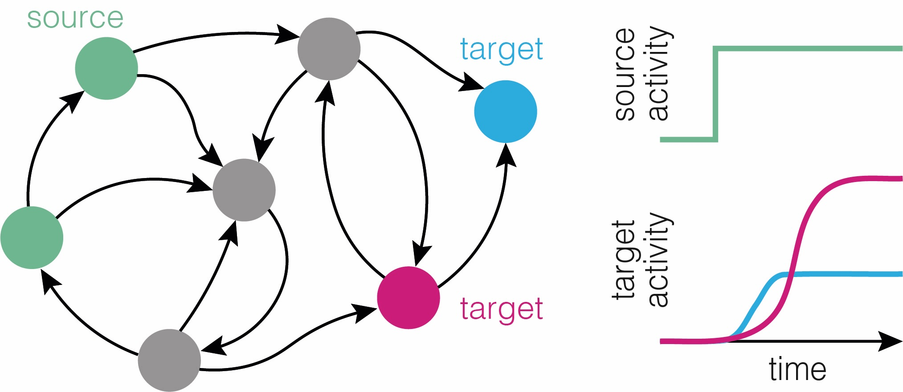
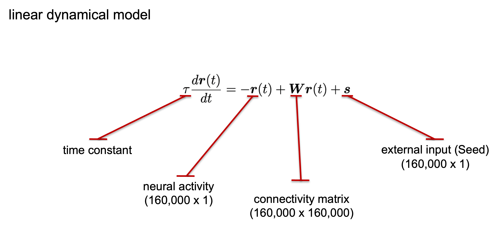
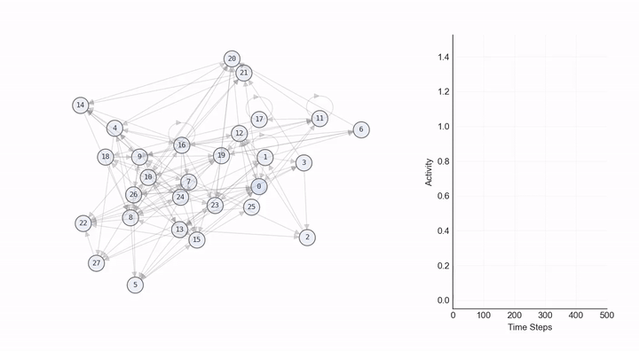
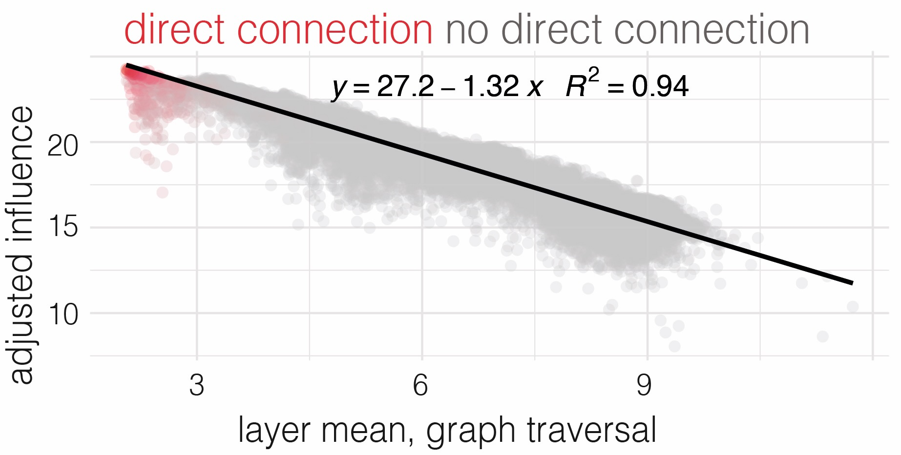
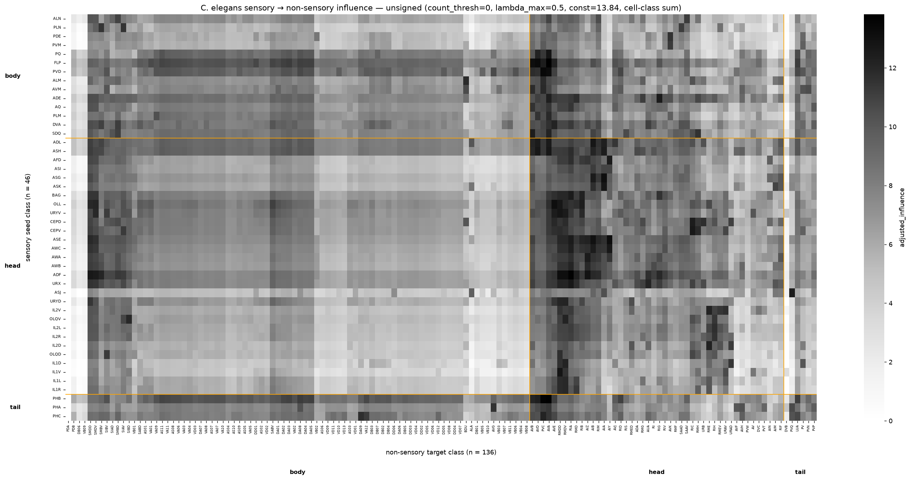
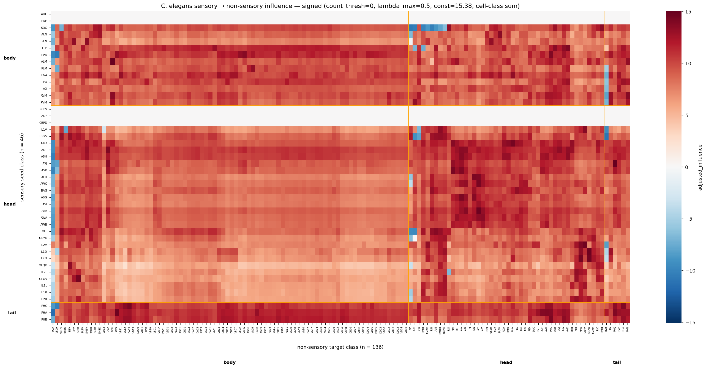

# ConnectomeInfluenceCalculator

[](https://doi.org/10.1038/s41586-026-10735-w)
[](https://www.biorxiv.org/content/10.1101/2025.07.31.667571v3)
[](https://zenodo.org/badge/latestdoi/964174582)

This code computes the influence scores of a neuron or a group of neurons (seed) on all downstream neurons in the connectome based on a linear dynamical model of neural signal propagation. The algorithm is introduced and applied to the whole-CNS *Drosophila* BANC connectome in the [BANC paper](https://doi.org/10.1038/s41586-026-10735-w) (Bates, Phelps, Kim, Yang et al., *Nature* 2026 — open access).

## Install

Download the repository, using either the [current main branch](https://github.com/DrugowitschLab/ConnectomeInfluenceCalculator/archive/refs/heads/main.zip) or one of the [past releases](https://github.com/DrugowitschLab/ConnectomeInfluenceCalculator/releases). Then, either directly install the zipped version using
```sh
python3 -m pip install ConnectomeInfluenceCalculator-main.zip
```
or unzip the files into a folder and run
```sh
python3 -m pip install .
```
in that folder.

### Troubleshooting PETSc and SLEPc installations

The package relies on the the [PETSc](https://petsc.org/) and [SLEPc](https://slepc.upv.es) libraries to perform sparse matrix computations. These libraries consist of the core libraries, and associated Python wrappers. The core libraries might not install correctly through `pip`. If this happens, a possible work-around is to install them through other means (e.g., using Homebrew on OS X), and then tell the Python wrappers `petsc4py` and `slepc4py` where to find them by calling
```sh
export PETSC_DIR = /path/to/PETSc/installation
export SLEPC_DIR = /path/to/SLEPc/installation
```
before running the above `pip` commands. Please make sure that installed core libraries have the same version numbers as the Python wrappers that will be installed.

Alteratively, both libraries and their Python wrappers can be installed using `conda`. In this case, we highly recommend creating a virtual environment with a specific Python version (version `3.13.1` worked for us):
```sh
conda create -n ic-venv python=3.13.1
```
After activation of the virtual environment `ic-venv`, the packages can be installed by executing the following commands:
```sh
conda install -c conda-forge petsc petsc4py
conda install -c conda-forge slepc slepc4py
```

## Description

> An R port of the same algorithm — with a native R backend and a `reticulate` wrapper around this library — is available as [`natverse/influencer`](https://github.com/natverse/influencer).



A constant input is held at one or more **source** (seed) neurons; the linear-cascade model below propagates that input through the connectome to a steady state, and each downstream **target** neuron's steady-state activity is its **influence score** — a single number summarising how strongly the source drives that target through any combination of direct and indirect paths. Formally, the dynamics are the linear ODE:

$$
\begin{aligned}
\tau \frac{d \boldsymbol{r}(t)}{dt} &= - \boldsymbol{r}(t) + \boldsymbol{W} \boldsymbol{r}(t) + \boldsymbol{s}(t) \\
&= \left( \boldsymbol{W} - \boldsymbol{I} \right)\boldsymbol{r}(t) + \boldsymbol{s}(t)
\end{aligned}
$$



where $\boldsymbol{r}$ is the vector of neural activity, $\boldsymbol{W}$ is the connectivity matrix, and $\boldsymbol{s}$ is the simulated neural stimulation (applied to the seed neurons and held constant throughout the simulation). The connectivity matrix is constructed by mapping the neuron IDs to matrix indices and arranging them so columns correspond to presynaptic neurons and rows to postsynaptic neurons. Two choices are available for the per-entry weight, selected via the `syn_weight_measure` constructor argument:

- `syn_weight_measure='count'` (default) — the raw synapse count from a presynaptic partner. Recommended when `signed=True`, because flipping the sign of a raw count is unambiguous.
- `syn_weight_measure='norm'` — the **input-normalised** weight, i.e. the synapse count divided by the total number of synapses received by the postsynaptic neuron, so each entry represents the fraction of a postsynaptic neuron's drive that comes from a given upstream partner. This normalisation makes per-edge weights comparable across neurons that vary widely in size and total input count.

Note: `syn_weight_measure='norm'` combined with `signed=True` produces columns that no longer sum to 1, so the input-normalisation interpretation no longer strictly holds — `'count'` is the cleaner pairing in signed mode.

To ensure stable neural dynamics, we rescale $\boldsymbol{W}$ such that its largest real eigenvalue equals a tuneable target $\lambda \in (0, 1)$:

$$
\begin{equation}
    \tilde{\boldsymbol{W}} = \frac{\lambda}{\lambda_{\max}(\boldsymbol{W})} \boldsymbol{W}
\end{equation}
$$

where $\lambda_{\max}(\boldsymbol{W})$ is the largest real eigenvalue of $\boldsymbol{W}$, and $\lambda$ is the desired largest real eigenvalue of $\tilde{\boldsymbol{W}}$ — exposed as the constructor argument `lambda_max` (default `0.99`). It sets the gain along the leading recurrent mode of $(\boldsymbol{I} - \tilde{\boldsymbol{W}})^{-1}$ to $1/(1-\lambda)$ — so `100×` at the default, `2×` at `lambda_max=0.5`.

Intuitively, **`lambda_max` is a reverb knob**. Near 1, a signal injected at the seed echoes through the network many times before fading, and the dominant recurrent loop drowns out finer differences between targets — every target column ends up with nearly the same shape. The default `0.99` (seems to be appropriate for the whole-CNS *Drosophila* BANC connectome and larger graphs, where the leading-mode amplification surfaces real weak distal influence). Near 0.5 the signal mostly traverses short paths, so per-target seed specificity is preserved at the cost of attenuating long polysynaptic effects (e.g. more appropriate for the *C. elegans* connectome, where the graph is small enough that the leading mode otherwise washes the heatmap out). Lowering `lambda_max` is the natural move when seed→target heatmaps look uniform across targets.

The steady-state solution is then:

$$
\begin{equation}
    \boldsymbol{r}_{\infty} = - \left( \tilde{\boldsymbol{W}} - \boldsymbol{I} \right)^{-1} \boldsymbol{s} .
\end{equation}
$$



The animation above shows the same dynamics on a 28-node toy graph: a constant input applied to one seed propagates through the connections, and each neuron's activity rises until the system reaches its steady state $\boldsymbol{r}_{\infty}$. **The influence of any seed is defined as the magnitude of neural activity at steady state**, so each curve's plateau height is the influence score for that target.

All matrix computations are performed using parallel computing libraries PETSc and SLEPc which adapt well to problems involving large, sparse matrices, like neural connectivity matrices, and allow fast computation of the steady-state solution.

## BANC Dataset

The BANC dataset is available for download at https://doi.org/10.7910/DVN/8TFGGB.

If you only need the edge list, a Feather-formatted copy is hosted on the lab's public Google Cloud Storage bucket:

```
gs://lee-lab_brain-and-nerve-cord-fly-connectome/compiled_data/banc_888/banc_888_edgelist_simple_v2.feather
```

(equivalent HTTP: <https://storage.googleapis.com/lee-lab_brain-and-nerve-cord-fly-connectome/compiled_data/banc_888/banc_888_edgelist_simple_v2.feather>). Drop it into `InfluenceCalculator.from_feather('banc_888_edgelist_simple_v2.feather', 'banc_888_meta.feather')` once downloaded (or pair it with an in-memory meta DataFrame by going through `InfluenceCalculator(pd.read_feather(...), meta_df)`).

## Usage

To run a test example, start by importing the InfluenceCalculator package:

```python
from InfluenceCalculator import InfluenceCalculator
```

`InfluenceCalculator.__init__` takes the input format closest to its internal representation: a pandas DataFrame edge list plus an optional metadata DataFrame. Five `from_*` classmethods adapt other formats to the same constructor — they take the format-specific path argument plus `**kwargs` that forward to `__init__`:

```python
ic = InfluenceCalculator(edges_df, meta_df)                                  # DataFrames
ic = InfluenceCalculator.from_sql     ('BANC_dataset.sqlite')                # SQLite (legacy schema)
ic = InfluenceCalculator.from_csv     ('edges.csv',     'meta.csv')
ic = InfluenceCalculator.from_parquet ('edges.parquet', 'meta.parquet')      # needs pyarrow
ic = InfluenceCalculator.from_feather ('edges.feather', 'meta.feather')      # needs pyarrow
ic = InfluenceCalculator.from_numpy   (W_dense)                              # pre-built adjacency
```

Each path expects the edge list to carry `pre`, `post`, and either `count` (raw synapse count) or `weight` (a pre-normalised edge weight); `norm` is optional and recomputed from `count` if absent. The metadata frame needs `root_id`, plus `top_nt` when `signed=True` or `excluded_nts` is set. **Missing columns raise a `ValueError` that names the required columns and lists the columns you actually passed**, so a typo or a wrong-shape input fails fast with an actionable message rather than a silent bad result.

By default, the programme simulates neural signal propagation based on an unsigned version of the connectivity matrix. However, it is possible to use a signed version whereby synaptic weights of inhibitory neurons are assigned negative values. When `signed=True` you must declare which neurotransmitter labels in the `top_nt` metadata column should be treated as inhibitory; the library does not assume a default. Users can also specify a minimum threshold count for the number of synaptic connections to retain (default is `5`):

```python
# Build InfluenceCalculator object — Drosophila convention
drosophila_inhibitory_nts = {'glutamate', 'gaba', 'serotonin', 'octopamine'}
ic = InfluenceCalculator.from_sql(
    'BANC_dataset.sqlite',
    signed=True, count_thresh=5,
    inhibitory_nts=drosophila_inhibitory_nts)
```

Let us now, define the seed group as all 'olfactory' neurons and calculate the influence of this seed on all downstream neurons while making sure to inhibit all non-seed sensory neurons:

```python
# Define seed category (depending on how neurons are labelled in metadata)
meta_column = 'seed_01'
seed_category = 'olfactory'

# Get seed neuron ids
seed_ids = ic.meta[ic.meta[meta_column] == seed_category].root_id 

# Get neuron ids to inhibit (sensory neurons in this case)
silenced_neurons = ic.meta[
    ic.meta['super_class'].isin(['sensory',
                                 'ascending_sensory'])].root_id

# Calculate influence scores and store them in a Pandas dataframe
influence_df = ic.calculate_influence(seed_ids, silenced_neurons)
```

Executing this returns a DataFrame with the neuron IDs, a Boolean `is_seed` column, the raw influence column (`Influence_score_(unsigned)` or `Influence_score_(signed)`), and three log-compressed `adjusted_influence` columns produced by `adjust_influence` (described below). Pass `adjust=False` to `calculate_influence` to skip the adjusted columns and return only the raw score. Note that even though we selected all sensory neurons to be inhibited, `calculate_influence` ensures no seed neuron is silenced.


## `adjust_influence`: log-compression and grouping

Raw influence scores from `calculate_influence` span many orders of magnitude — the leading eigenmode of `(I - W̃)⁻¹` is amplified by `1 / (1 - lambda_max)` (≈ 100× at the default `lambda_max=0.99`), and weakly connected nodes pick up vanishingly small values that crowd the lower tail. `adjust_influence` makes the output legible by taking the natural log and shifting it so the smallest meaningful score sits at zero. It runs by default at the end of `calculate_influence` (so the returned DataFrame already carries adjusted columns) and is also exposed as a standalone module-level function for advanced workflows that aggregate raw influence across multiple seed runs before re-adjusting.

```
adjusted_influence = log(raw_influence) + const
```



The plot above compares `adjusted_influence` (y-axis) against **graph-traversal depth** (x-axis) — the average number of synaptic hops a signal must traverse to reach a given target from the seed via shortest-path BFS through the connectome — for one seed neuron in the BANC connectome. Targets that are *directly* connected to the seed (red) sit at the top of the distribution; targets reached only by longer indirect chains (grey) sit lower. The relationship is almost linear (R² = 0.94, slope ≈ −1.3), which means each additional synaptic step costs roughly 1.3 units of `adjusted_influence` — so a four-hop target lands ≈ 5 units below a directly-connected one. This near-linear scaling is what makes the score easy to read off a heatmap and to compare across seed/target groups: differences in `adjusted_influence` map onto differences in *effective polysynaptic distance*, with the log transform turning the multiplicative gain stack of indirect paths into additive units.

`const` defines the floor: any score below `exp(-const)` is clipped to zero (a "junk-node" cutoff for nodes that are nearly disconnected from the seed). The default `const=24` is calibrated for the *Drosophila* BANC connectome (~130k neurons, minimum meaningful score ~3.8e-11). For smaller networks, compute it from your data:

```python
import numpy as np
results = ic.calculate_influence(seed_neurons)
raw_col = 'Influence_score_(unsigned)'  # or 'Influence_score_(signed)'
min_nonzero = results.loc[results[raw_col] > 0, raw_col].min()
const = -np.log(min_nonzero)
adjusted = adjust_influence(results, const=const)
```

For the bundled C. elegans dataset (300 neurons) this gives `const ≈ 11–15`, depending on `lambda_max` and the transmitter filtering.

`adjust_influence` also handles **grouping**. If your DataFrame has `seed` and/or `target` columns (e.g. you ran several seeds and concatenated the results), it sums raw influence within each `(target, seed)` group before the log transform and returns three columns:

| column | formula | when to use |
|---|---|---|
| `adjusted_influence` | `log(Σ raw) + const` | comparing pairs |
| `adjusted_influence_norm_by_targets` | `log(Σ raw / n_targets) + const` | comparing seeds with very different downstream fan-out |
| `adjusted_influence_norm_by_sources_and_targets` | `log(Σ raw / (n_sources · n_targets)) + const` | comparing across seed/target groups of different sizes |

In **signed** mode, `adjust_influence` preserves the sign through the log transform: a target with net-inhibitory drive returns a negative `adjusted_influence`, with magnitudes below the floor clipped to zero in either sign.


## Worked example: C. elegans connectome

The package ships with the *C. elegans* hermaphrodite chemical connectome (300 cells — neurons plus a few pharyngeal muscle / gland / epithelial cells; 3,539 chemical edges; 20,672 synapses) so the full pipeline is runnable out of the box, without downloading any external data.

### Data source

The bundled CSVs were taken from the [OpenWorm project](https://openworm.org/) distribution of the *C. elegans* hermaphrodite chemical connectome (accessed **February 2026**), which aggregates the original electron-microscopy reconstructions of [White et al. 1986](https://doi.org/10.1098/rstb.1986.0056) and [Cook et al. 2019](https://doi.org/10.1038/s41586-019-1352-7), with neurotransmitter and cell-class annotations from [WormAtlas](https://www.wormatlas.org/) and [CenGen](https://cengen.shinyapps.io/CengenApp/) (Taylor et al. 2021). If you redistribute results computed from this graph, please cite the OpenWorm project alongside the underlying connectome papers — see `help(InfluenceCalculator.data)` for the full BibTeX.

### Running the example

A minimal end-to-end run:

```python
from InfluenceCalculator import InfluenceCalculator
from InfluenceCalculator.data import celegans_edgelist, celegans_meta

ic = InfluenceCalculator(
    celegans_edgelist(), celegans_meta(),
    signed=True,
    inhibitory_nts={'gaba'},
    excluded_nts={'glutamate', 'dopamine', 'serotonin', 'octopamine'},
    lambda_max=0.5)

seeds  = celegans_meta().query("super_class == 'sensory'")['root_id']
result = ic.calculate_influence(seeds.tolist(), adjust_const=15)
```

The full script — including the heatmaps below, cell-class summation across bilateral pairs, and `body_part`-grouped clustering — lives in [`examples/celegans_worked_example.py`](examples/celegans_worked_example.py); run from a clone with `python examples/celegans_worked_example.py`. The three knobs at the top of the script are the ones you'll most often want to tune:

| knob | purpose |
|---|---|
| `inhibitory_nts` / `excluded_nts` | which `top_nt` values are negated vs zeroed in signed mode. The library has no per-organism defaults; only acetylcholine (positive) and GABA (negated) have unambiguous signs in *C. elegans*, so the rest are excluded. The example file's header comment lists *Drosophila* and *C. elegans* conventions side by side. |
| `lambda_max` | target spectral radius of W̃ — the "reverb knob" introduced in the [Description](#description). Default `0.99` (gain `100×`) makes every target column share a near-identical shape; `0.5` (gain `2×`, used here) exposes per-target seed specificity. |
| `const` (for `adjust_influence`) | auto-calibrated from the data so the smallest non-zero magnitude maps to 0 — see the [`adjust_influence`](#adjust_influence-log-compression-and-grouping) section above. |





Influence from every sensory neuron (n = 83 → 46 cell classes after collapsing bilateral pairs) onto every non-sensory target (n = 187 → 136 classes); pharyngeal neurons excluded because the pharynx is functionally isolated. The unsigned variant counts every edge positively (no biology assumed); the signed variant negates GABA-pre-neuron weights and drops the ambiguous transmitter classes — net-inhibited (target, seed) cells appear blue.

## Citation

If you use the influence scores produced by this library in published work, please cite Bates, Phelps, Kim, Yang et al. (2026), where the algorithm is introduced and applied across the BANC whole-CNS *Drosophila* connectome:

> Bates AS, Phelps JS, Kim M, Yang HH, Matsliah A, Ajabi Z, Perlman E, *et al.* (2026).
> *Distributed control circuits across a brain-and-cord connectome.*
> **Nature** (open access). <https://doi.org/10.1038/s41586-026-10735-w>.
> Preprint: bioRxiv 2025.07.31.667571 (v3), <https://www.biorxiv.org/content/10.1101/2025.07.31.667571v3>.
> PMID:[40766407](https://pubmed.ncbi.nlm.nih.gov/40766407/).

```bibtex
@article{bates2026distributed,
  title   = {Distributed control circuits across a brain-and-cord connectome},
  author  = {Bates, Alexander Shakeel and Phelps, J. S. and Kim, M.
             and Yang, H. H. and Matsliah, A. and others
             and {BANC-FlyWire Consortium}},
  journal = {Nature},
  year    = {2026},
  doi     = {10.1038/s41586-026-10735-w},
  url     = {https://doi.org/10.1038/s41586-026-10735-w},
  note    = {Open access. Preprint v3: https://www.biorxiv.org/content/10.1101/2025.07.31.667571v3 (PMID: 40766407; PMCID: PMC12324551)}
}
```

For citing the software itself, the [Zenodo DOI badge](https://zenodo.org/badge/latestdoi/964174582) at the top of this README resolves to a citable record for the latest release.

## Contributing
For contributions and bug reports, please see the [contribution guidelines](https://github.com/DrugowitschLab/ConnectomeInfluenceCalculator/blob/main/CONTRIBUTING.md).

